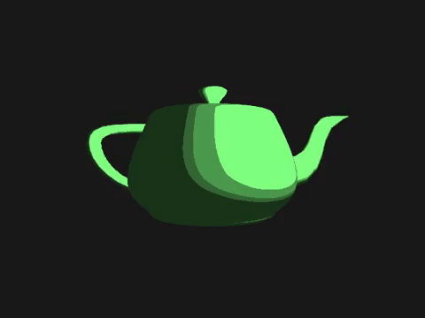

# Silkie



(This GIF doesn't quite do it justice. Check out [the full 60fps glory](https://youtu.be/FTQR54kOMtc), or in the [version that loops forever](http://www.infinitelooper.com/?v=FTQR54kOMtc&p=n). A humble scene, to be sure, but this was rendered completely in software on a headless server.)

---

A library that lets you write standard OpenGL code, but uses [OSMesa](https://www.mesa3d.org/osmesa.html) to render to image files on disk instead of the screen. Useful for automated generation on a headless server, or a poor excuse for a proper ray-tracer. (Though it's much faster than most ray-tracers...)

Lots of other programs integrate OSMesa, but usually it's deeply integrated with whatever their rendering pipeline needs. This is a slim library and set of sample executables that give a clear entry point and a way to hand it over to your own code. 

The original goal for this was to have a single library that could swap out its rendering backend programatically, but it turns out that trying to link both the system OpenGL and the OSMesa implementation at once causes issues. So instead there are two version of the library, one that renders to regular OpenGL and one that renders to disk. Maybe could be solved with some kind of clever dynamic loading? In the meantime, I'm content to just deal with a recompile. 

The build process (especially for OSMesa) is somewhat arduous, so I wanted to preserve a reproducible build for the sake of my own future self. Perhaps others may stumble across it and find it useful. 

Builds on Mac and Linux. At least, it builds on the one Linux box I need it to. Probably others. Could be made to build on Windows, conceivably, but not my use case. 

## Usage

The `examples` directory shows the basic setup; pay special attention to the linkage action happening in the Makefile. 

Framework code:

```c++
#include <silkie.h>

int update(void* ctx, double dt) {
    // Run all your simulation stuff here, 
    //  based on the timestep dt.

    if (should_keep_running()) {
        return 1;
    }
    else {
        return 0;
    }
}

void render(void* ctx) {
    // Render here just like it was totally 
    //  normal OpenGL.
}

int main(int argc, char *argv[]) {
    // Process my command-line arguments...

    int width = 800;  // pixel width of output
    int height = 800; // pixel height of output
    int fps = 60;     // output frames per second

    // Gets an opaque handle to an OpenGL context
    //  might be a native GLFW window or a structure
    //  containing an OSMesa context, depending on 
    //  which version of Silkie we're linking against.
    //
    // You can also specify a major and minor version
    //  number for your preferred version of OpenGL.
    //  OSMesa can give you more or less any version,
    //  but if you're linking to silkieN, you're 
    //  limited by what your hardware and OS can do.
    // Long story short, this might return NULL. 
    // If you don't specify a version, you'll get
    //  good old classic OpenGL 1.5, for all your 
    //  glVertex-calling needs. 
    void* ctx = silkie_get_context(width, height);

    // Your own function where you do all the 
    //  standard OpenGL setup
    setup();

    // Register your update and render calls with 
    //  Silkie's run loop.
    silkie_register_update(update);
    silkie_register_render(render);

    // Start the loop. The output directory and 
    //  framerate are ignored when running in 
    //  preview mode with a GLFW window.
    // NB: this function will never exit unless 
    //  update returns 0
    int run_val = silkie_run(ctx, "output_directory", fps);

    // report out the results as exit code if you want
    return run_val;
}
```

## Questions

These are not frequently asked (nor, in fact, asked at all), but more recording my own thought process. 

### Can it build on Windows?
Maybe. I'm guessing, based on my own trials, that the biggest barrier would be getting [OSMesa](https://www.mesa3d.org/osmesa.html) building. [Frédéric Devernay](https://github.com/devernay/osmesa-install/) seems to have something working using SCons, but I haven't experimented myself. I'd be interested to hear from anyone who tries, even if they fail and give up. 

There's also a minimal amount of file handling code that assumes *nix conventions, but that's easily amended if the bigger problems are solved.

### Is it thread-safe?
If so, it's entirely by accident.

### Can the scene be tweaked and previewed?
If you link against libSilkieN instead of libSilkie (AND define `SILKIE_OFFSCREEN` to 0 in your preprocessor), instead of writing to disk, it will pop a window rendering the scene, courtesy of [GLFW](http://www.glfw.org/). Note that in environments with high-density displays (like Retina Macs), you may need to double the offscreen image capture size to get comparable output quality. 

### Does it support advanced OpenGL features?
Some of 'em. It does what I need it to do, for now. To do more might take some code tweaks. The code for Silkie itself is tiny and easily modifiable; for the most part I made this for the sake of recording how to build and link OSMesa. If there are easy changes to Silkie that would let it support something you want it to do, lemme know. 

### Can it output video? 
It's pretty trivial to stitch the image sequence together with [FFmpeg](http://www.ffmpeg.org/) or the like, and I'd rather just do that than try and integrate yet another huge library. 

Here is a pretty good starting point that uses YouTube's recommended settings, assuming an output of 60fps:

`ffmpeg -framerate 60 -i image_path/%d.png -c:v libx264 -profile:v high -bf 2 -g 30 -coder 1 -crf 18 -pix_fmt yuv420p -movflags +faststart out.mp4`

### Can it output other image formats? 
Most definitely, but you'll have to put in the effort yourself. The image writing is behind the `SILKIE_OFFSCREEN` preprocessor definition in `silkie_run`. It's pretty straightforward. Knock yourself out. 

### Why not just use FRAPS or something?
Silkie is intended for rendering with no graphics card or monitor at all. Also, with screen capture software you're limited by the capabilities of your hardware, whereas Silkie can output smoothly and consistently at *whatever framerate you want*... just not in real time. :) 

### Why not capture an OpenGL window?
The serverless answer is still compelling here, but I started researching software rendering when I saw how slowly most pipelines read data back from the GPU. Keeping it all on the CPU side speeds it up immensely when you're trying to render out a lot of frames.

### It's in C, but needs a C++ compiler?
Because OSMesa uses LLVM's core libraries, the final executable needs access to a C++ runtime for linkage. Annoying, for sure. 

### It takes forever to build...
Yeah, it has to make its own private version of LLVM first, which is a long compile. OSMesa takes a while, too. Make some tea or go for a walk the first time it builds; once the library is built, you should be able to leave it alone and work on your client code.

### Silkie?
1. It runs without a head. ([Silkie](https://en.wikipedia.org/wiki/Silkie))
2. It produces smooth animations. ([Silky](https://www.merriam-webster.com/dictionary/silky))
